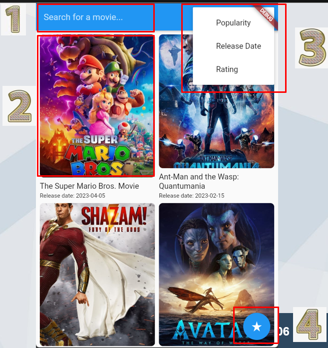
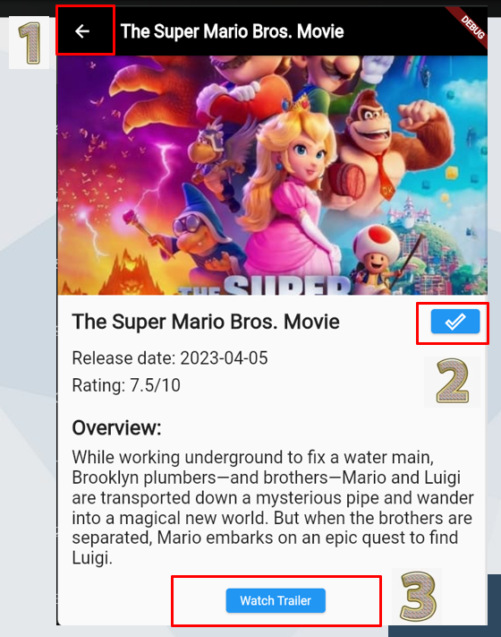
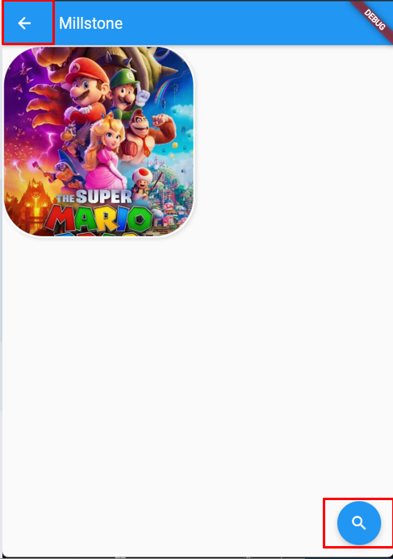

# Movie Home

This app is create for user to search,sorting movie with their like.and for the user who like to collecti how many movies they have seen.

## details in seperate pages 
Movie search Page:
1: for search function, can show the search result after input the key word

2: click on the poster of movie can jump to movie detail page

3: can choose different sorting way

4: jump to millstone page

Movie detail page
1.Back to search results

2.Click that button shows you have finish watching that movie and add it to millstone page

3.Watch trailer on Youtube
                                     

Millstone page
These two buttons are all responsible for back to movie search page.

## Api selection:
the movie DB API, it cantains most movie in the word and it still updated this time.

## Dependency of this project
After download this project still need to download some dependency to make the code work.

import 'package:flutter/material.dart'; 

import 'package:url_launcher/url_launcher.dart'; 

import 'package:http/http.dart' as http; 

import 'dart:convert'; 

import 'package:cloud_firestore/cloud_firestore.dart'; 

import 'package:firebase_core/firebase_core.dart'; 

import 'firebase_options.dart'; 

please google these and make sure these have been doneload properly.
